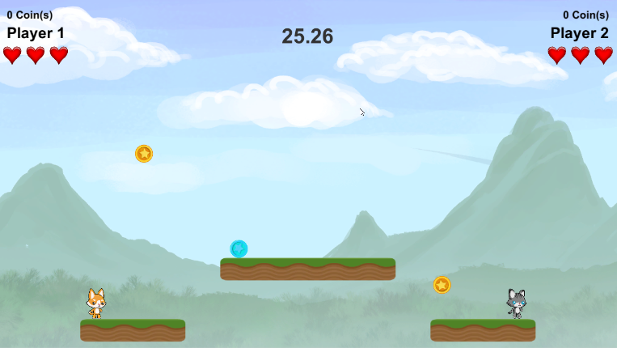

## Introduction

Make a two player game using Unity. You will learn how to create an **animation**, what **Object Oriented Programming** is, and more! 

This tutorial builds off the knowledge learned in the previous two Sushi Cards, so if you haven't done those, try them out now!

### What you will make

In this project you will create a 2D platformer game. If you have done the **Scratch Sushi Cards**, it might remind you of that. At the end you can try to code your own powerups!

### What you will learn

### Additional information for educators

Use the link in the footer to access the GitHub repository for this project, which contains all resources (including an example finished project) in the 'en/resources' folder.
