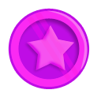
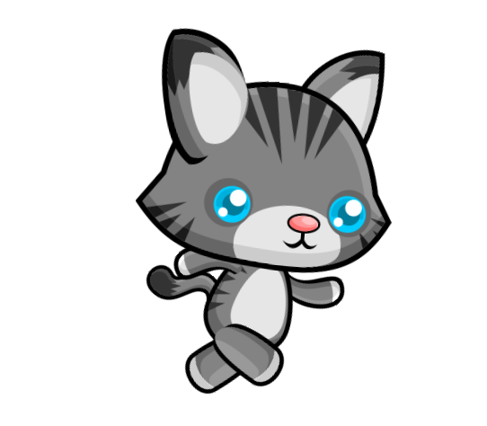
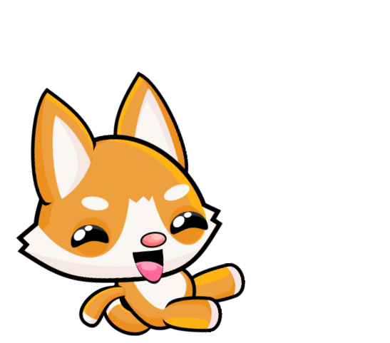

## Extra Additions!

You've finished up the base of the game! Now there is a lot of fun stuff you can add to it! Here are some ideas to get you started...

+ Design, then create your own levels for the players to move on. Don't forget to add them to the levels menu with some more buttons! There are some platform prefabs in the "prefabs" folder that you can use if you like.
    
+ Make your own powerups! You can use the same process as the speed up powerup. Try to make your player bigger or smaller! There are some extra coins in the "prefabs" folder for you to use.
   

+ Make a portal that transports the player from one side of the map to another!

+ Make an obstacle that moves back and forth on a platform. If it touches a player, then you should make that player lose a life.

+ Try to make the platformer a side scroller. **Hint:** You can make it seem like the player is moving by creating the prefab on one side of the screen then moving it to the other. (Remember to destroy the platform when it's off the screen!)

+ Make some more animations! In the "Animations" folder you will find more images that you can make animations out of like running and sliding. If you want a challenge try to make the players run when they get a speedup power up.
   

    

