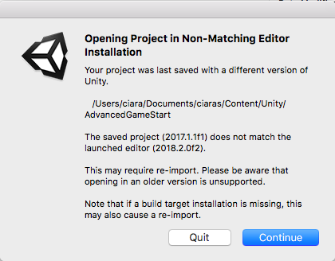
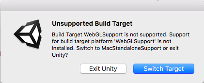

## What you will need

### Hardware

+ List hardware here, or delete section.

### Software

+ Unity

### Additional Resources

+ Download the starter project from [dojo.soy/AdvancedUnityStarter](http://dojo.soy/AdvancedUnityStarter). It provides you with some code that you've already learned in previous tutorials. You can read through the comments in the code if you want to understand what it is doing!

--- collapse ---
---
title: Messages pop up when I try to open the project
---

Depending on which version of Unity you are using, you might see a message like these when you open the project:

+ Click "Continue" to open the project. Note: if you are using an older version of Unity, you may need to update Unity before you can open the project.

Also, depending on what operating system you have, you might get a message like this:

+ Simply click "Switch Target" to continue.

--- /collapse ---

+ Anywhere you need to add code look for a line comment that looks like this: 

`/*####################################################################*/`.  

+ After you are done making your game, you will have the option to build it with WebGL. Downloading Unity's WebGL package in advance will save you time. To do this go to (**File > Build Settings**) in Unity and select **WebGL** from the **Platform** list. Now, click the **Open Download Page** button on the right of the **Platform** list. (**Do not try to build it just yet though!**)
