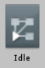
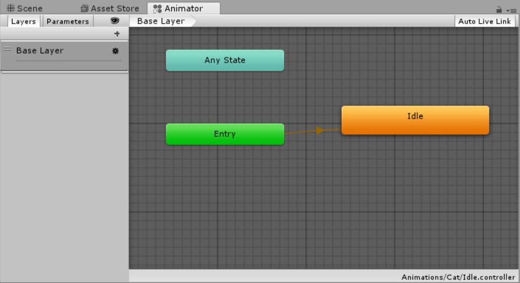

## Animations

**Animation** is using multiple images and playing them in a sequence. Unity has a built in **Animator** that allows you to easily create your own animations. 

Creating your own **animations** is easy in Unity!

+ To create an **Animator** all you need to do is shift click all ten of the Idle images and drag them all into the inspector. You will have to save the **animation**, give it a name like "Idle". 

+ Now hit play and watch your new animation!
    
+ Now lets open the animator. When you created your animation it will have made an **Animator** and an **Animation** files. These are what the files look like in the **Project** window.  

The animator file looks like: 

 

The animation file looks like: 

+ Open up the **Animator** by double clicking the animator file and a window should open up and look like this: 

+ To create more **animations** for your sprite, repeat the above steps for the Walk and Jump images.

+ Delete both of the new **Animators** for these two animations. You only need one **Animator** to control all of the animations for one sprite.

+ You can add more animations to the **Animator** by dragging the animation file into the **Animator**.

+ You can right click the different animations in an **Animator** and set them to "Set as Layer Default State" and run the program to see your different animations!

+ To play different animations with scripts, you just need to get a sprite's **Animator** and use the code `Animator.Play('the name of the animation')`.
