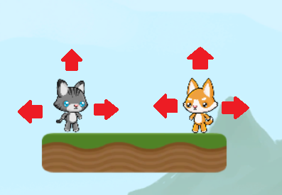

## Setting up your player objects

When working with an **Object Oriented Programming (OOP)** language, such as C#, you need to decide which objects you will be programming. Your game will have two players, so you need two player objects. These players will control two sprites that do the same thing. So, you can use a single **class** or **struct** as a template for both of these objects.



--- collapse ---
---
title: What is Object Oriented Programming?
---

Object Oriented Programming (OOP for short) is focusing on the **objects** that you will be programming. 

An **object** is an **instance** (a single item that can be a copy of others) of a **class**. A class is a template and the object is the product. 

Using the analogy of baking a cake, the class is the recipe and the object is a cake. You can then use that recipe (**class**) to make another cake (**object**) that have the same ingredients (**variables**), but they are two different cakes. 

--- /collapse ---

--- collapse ---
---
title: Classes or Structures?
---

When you create a template, you need to choose between a **Structure** (struct) or a **class**.

The most important difference is that a **class** is a **reference type** and a **struct** is a **value type**.

Basically, this means you can access a value in a **class** and change it, but in a **struct** you can only access the value. 

--- /collapse ---

You want to use a **class** because you will be changing different variables  of the players.

+ To create a class, open the C# script named: "PlayerController". Underneath the `using` statements and above the `public class playerMover : MonoBehavior` create your **Player** class by adding this code: 

```csharp
public class Player
{
    
}
```

Now you need to add the variables that will make up a player. These values are used by the **StartingCodeForPlayer** script to move the player and make animations.

+ Add the following variables to your **class**:
    
```csharp
public string         name;

public GameObject     sprite;
public SpriteRenderer spriteRenderer;
public Rigidbody2D    rigidbody;
public Animator       animator;

public char           direction;
public bool           jumping;
public float          jumppower, movespeed, powerupTime;
```
   
+ Finally, add this **constructor** to the **class**:

```csharp
public Player(string playerName)
{
    name = playerName;
    sprite = GameObject.Find(playerName);
    spriteRenderer = sprite.GetComponent<SpriteRenderer>();
    rigidbody = sprite.GetComponent<Rigidbody2D>();
    animator = sprite.GetComponent<Animator>();
    jumping = false;
    jumppower = 500.0f;
    movespeed = 2f;
    powerupTime = 0.0f;

    if (playerName == "cat")
        direction = 'L';
    else
        direction = 'R';
}
```
 
--- collapse ---
---
title: What's a constructor?
---

A **Constructor** **constructs** (creates/makes) an object when you call the class. A **constructor** is a method (a function in a class) that has the same name as the **class** and it will set all of the variables for that object.

--- /collapse ---

That's it, you created a class! The "PlayerController" script will use this class to move the two different players. 