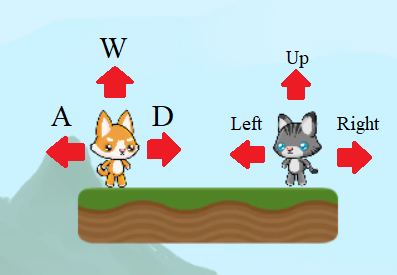

## Moving Two Players

Time to use the class you just created!

+ Open the "StartingCodeForPlayer" script. In it, you will find a some code already completed. This code has already been covered in previous tutorials, feel free to take a look through the code to understand what it does!

Creating an **object** is done by using the constructor you created earlier. This is called **instantiating** an object. In C# this is done with the **new** keyword. We will make a cat and a dog (the dog being the orange one and the cat the grey one).

+ In the "PlayerController" script class, add the declarations `public Player dog;` and `public Player cat;` to the top of the `PlayerController` class, above `void Start()`.

+ Add the line `cat = new Player("cat");` in the `Start()` function. It will create a new player object that's variable name is cat. Then do the same again, but replacing `cat` with `dog`. 

--- collapse ---
---
title: Check my code
---

Make sure your code looks like this in the PlayerController **class**:

```csharp
public Player cat;
public Player dog;

void Start()
{
    cat = new Player("cat");
    dog = new Player("dog");
    ...
```

--- /collapse ---

Now you have two objects, you need to get input from the user and assign what the user input does. You can use the `mover(Player player, KeyCode left, KeyCode right, KeyCode up)` function in the "StartingCodeFor Player" script.

+ Put these lines of code into the `void Update()` function:
    
```csharp
startingcode.mover(dog, KeyCode.A, KeyCode.D, KeyCode.W);
startingcode.mover(cat, KeyCode.LeftArrow, KeyCode.RightArrow, KeyCode.UpArrow);
```


    
--- collapse ---
---
title: Using different controls
---

You can change these KeyCodes to whatever keys you want them to be!

Here is a list of KeyCodes: [dojo.soy/UnityKeyCodes](http://dojo.soy/UnityKeyCodes)

--- /collapse ---
       
Now you can move the two different sprites at the same time!

+ Try it out!