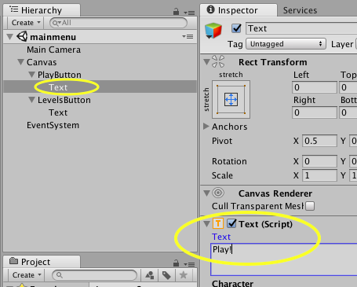
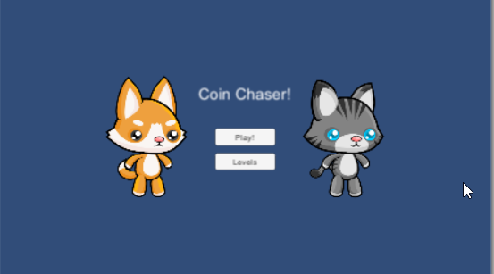
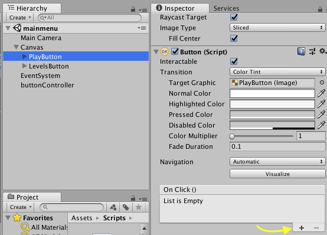
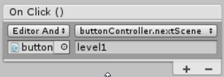

## Making Menus

Now it's time to create a menu system for your game! You will create a main menu, a levels menu, and a button to get to the menu after the game is finished.

+ To create a main menu you will need a new scene. Create one and call it something you can remember like `mainmenu` (remember, click **File > New Scene** to create a new scene and then **File > Save Scene as** to give it a name and save it. Be sure to save it in the "Scenes" folder!)

Now that you have a new scene, you can start creating the menu.

+ From the top menu go **GameObject > UI > Button**. Do this twice so you have two buttons and move them into a place that you like.

+ Change the **Text** object under the buttons in the hierarchy to `Play!` and `levels`.



+ Now you can give your game a name or add images to it. This will make it your own game! Here's what mine looks like:



+ For the levels menu, you can use the "levels" scene that I already created, but feel free to change it up so it looks how you want it to! 

+ Switch to the "mainmenu" scene. You will make the buttons work now!

+ To do this, create a new C# script. Replace `Start()` and `Update()` with
    
    ```csharp
    public void nextScene(string scene)
    {
        SceneManager.LoadScene(scene);
    }
    ```

+ You will also need to add `using UnityEngine.SceneManagement;` to the top of the script.

+ Save your script and go back to the scene in Unity.

+ Create an empty object and name it "buttonController". Attach the script you just created to it.

+ Go to the **Inspector** for your "play" button and find the "Button (Script)" property.

+ Find the **On Click ()** property and click the little **+** icon at the bottom left of it.



+ Drag the "buttonController" object from the **Hierarchy** to the bottom left box in the **On Click ()** property. Where it says **No Function**, click the drop down and select the script you created earlier, then select `nextScene(string)`.

+ Finally, write the name of the scene you want to switch to in the bottom right box. It should look like this if youve done it correctly:


    
+ Repeat this process for the "levels" button. Simply change the scene name in the bottom right box to `levels` and the button will switch to that scene instead.

+ Now switch to the "levels" scene and repeat the steps above to make the buttons on it switch to the different levels. You can reuse the same script you already created!

+ Run the main menu scene and test out the buttons. You should switch into the different scenes. 

--- collapse ---
---
title: Adding more levels
---

The levels that I gave you will have a button that pops up at the end of a game and bring you back to levels menu scene.

If you make new levels all you need to do is add buttons to the scene, main menu scene, and the levels menu scene. 

--- /collapse ---
