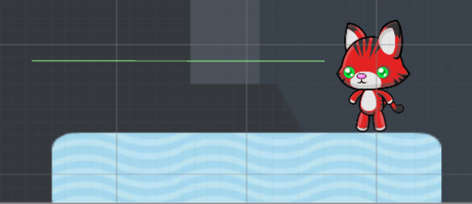

## Add to Your Platformer

Now you have the basics of your platformer game working you can add some new features!

A moving platform would be fun. You already know how to move an GameObject with `transform.position`, but its not easy to create a function that will move a platform back and forth! Luckily, Unity's developers created a function that lets you easily move a platform: `Mathf.PingPong()`. 

+ To make a moving platform open the "level2" scene from the scenes folder. Also create a C# script and attach it to the top platform in the "level2" scene.

+ Now add this line into the `Update()` function of your new script:

```csharp
transform.position = new Vector3((Mathf.PingPong(Time.time, 5f) - 2.5f), transform.position.y, transform.position.z);
```

--- collapse ---
---
title: How does the code work?
---

`Mathf.PingPong` will return a value between `0` and the second parameter (so it will return between 0-5 in this code).

You then need to subtract half the value so the number returned is between `-2.5` and `2.5` (that will make it so the platform is centered).

This number is going to be the x position of the platform for the `transform.position` function!
    
--- /collapse ---

+ Open the "level3" scene. You should see an evil red cat!

When the evil cat sees either of the players they should lose a life! How do you make the cat see? The answer is by adding **Colliders**. **Colliders** are the objects in Unity that trigger a **collision**. You've used **collisions** to do different things in the past. This time you will make an invisible **Collider** so it looks like the evil cat can "see".

+ Open the "evilCat"'s **Inspector** and click **Add Component > Physics 2D > Edge Collider 2D**.

Since it is night in this scene, evil cat can't see that far.

+ So, in evil cat's **Inspector** click the box left to **Edit Collider**. Now move the two ends of the line so they are above the platform evil cat is on. It should look like this:

    
    
+ The last step is to add some more code to the "Collisions" script. Change the if statement in `OnCollisionEnter2D(collision col)` from

```csharp
if (col.gameObject.tag == "fallzone" && lives > 0)
```

to

```csharp
if ((col.gameObject.tag == "fallzone" || col.gameObject.tag == "evilCat") && lives > 0)
```
     
Now if the evil cat "sees" one of the players they will lose a life. (The **Collider** cant be seen in the game view so the player will think evil cat saw them, but you know how evil cat actually "saw" them now!).